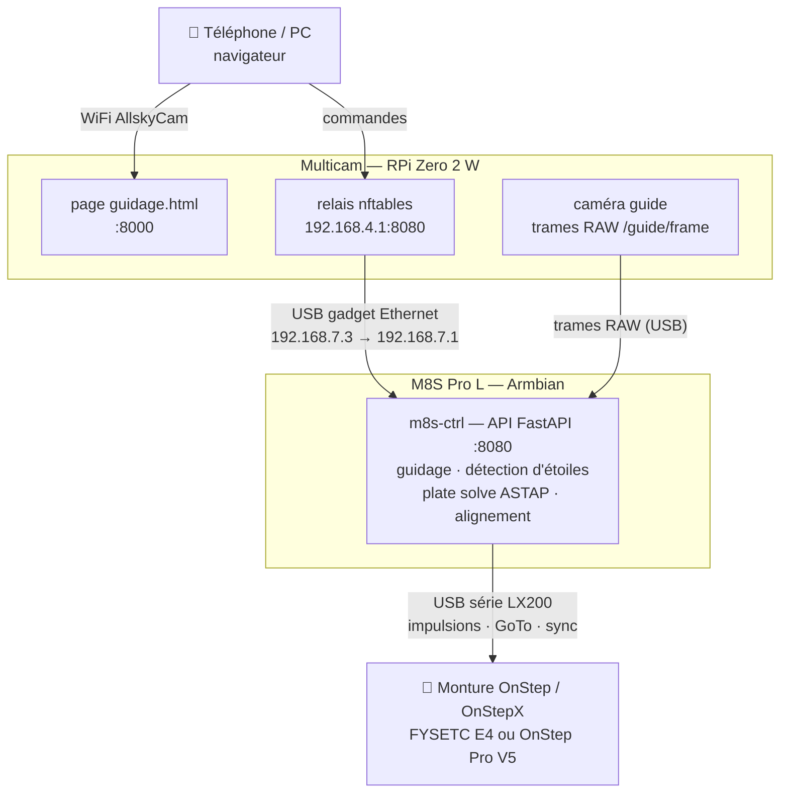

# M8S-AstroCtrl

Autoguideur autonome et alignement par plate solve pour montures
**OnStep / OnStepX**, installé sur un boîtier TV Android **MECOOL M8S Pro L**
(Amlogic S912) passé sous Armbian. La caméra de guidage est
[Multicam](https://github.com/remis-astr/Multicam) (Raspberry Pi Zero 2 W),
reliée en USB. L'interface est la page `guidage.html` servie par Multicam.
Tous les calculs se font sur le M8S.

## Schéma

Le téléphone ne parle qu'à Multicam, qui relaie les commandes vers le M8S.
Le M8S lit lui-même les trames de la caméra, fait tous les calculs et pilote
la monture.

## Fonctions

- Pilotage de la monture en **LX200 série direct** (pyserial, sans INDI).
  Le type de monture (EQ allemande, fourche, ALT-AZ) est détecté avec `:GU#`.
- **Plate solving ASTAP** des trames RAW de la caméra, alignement OnStepX
  sur N points (automatique ou à la raquette), sans avoir à viser d'étoile
- **Autoguidage** en EQ **et** en ALT-AZ. En ALT-AZ, la
  calibration est tournée de l'angle parallactique, et un pivot est
  réglable.
- Raquette manuelle avec sécurité « homme mort », courbes et RMS, mode
  simulation (ciel simulé) pour tester sans monture
- L'heure de référence est celle de la monture : le M8S recale son horloge
  dessus.

## Organisation

| Chemin | Rôle |
|---|---|
| `m8s-ctrl/main.py` | API FastAPI (port 8080), déployée dans `/opt/m8s-ctrl` |
| `m8s-ctrl/onstep.py` | protocole LX200 / OnStepX |
| `m8s-ctrl/solver.py`, `align.py`, `astro.py` | plate solve ASTAP, alignement, calculs astronomiques |
| `m8s-ctrl/guider.py`, `stars.py`, `guidecam.py` | guidage, détection d'étoiles, lecture des trames de Multicam |
| `m8s-ctrl/m8s-ctrl.service` | service systemd |
| `m8s-ctrl/backup-indi/` | ancienne version basée sur INDI (abandonnée) |
| `etc/NetworkManager/…/m8s-usb-allsky.nmconnection` | IP fixe 192.168.7.1 sur la liaison USB vers Multicam |
| `tools/e4time.py` | compare l'heure/TSL de la monture à l'heure réelle (arrêter `m8s-ctrl` avant : port série exclusif) |
| `tools/wsraw_test.py` | test du flux RAW `/ws/raw` de Multicam (`python3 wsraw_test.py <n> <fps>`) |
| `CONCEPTION.md` | objectifs et choix techniques |
| `ROADMAP.md` | avancement phase par phase, détails matériels |

## Prérequis

Armbian (bookworm, arm64), Python 3 avec `fastapi`, `uvicorn`, `pyserial`,
`numpy`, et ASTAP en ligne de commande avec une base d'étoiles (D50).
